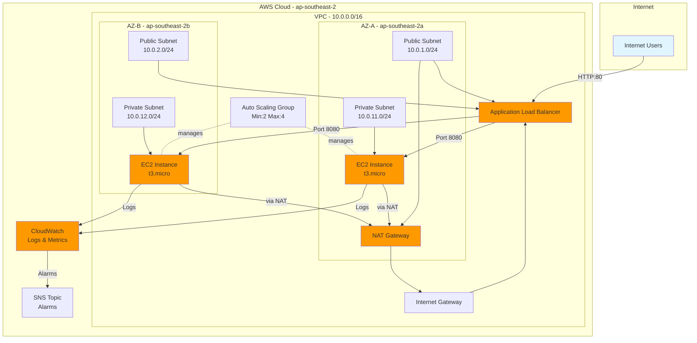

# Architecture Documentation

## Overview

This project implements a highly available, scalable web application infrastructure on AWS using EC2 Auto Scaling Groups behind an Application Load Balancer. The architecture follows AWS best practices for security, reliability, and cost optimization in a development environment.

## High-Level Design

The architecture consists of:
- **Application**: Simple Node.js HTTP server
- **Compute**: EC2 instances in Auto Scaling Group
- **Load Balancing**: Application Load Balancer
- **Networking**: Multi-AZ VPC with public and private subnets
- **Security**: IAM roles, security groups, and network isolation
- **Monitoring**: CloudWatch logs, metrics, and alarms

## Architecture Diagram

## Component Descriptions

### 1. VPC (Virtual Private Cloud)
- **CIDR Block**: 10.0.0.0/16
- **Purpose**: Isolated network environment for all resources
- **Components**:
  - 2 Public Subnets (10.0.1.0/24, 10.0.2.0/24) across 2 AZs
  - 2 Private Subnets (10.0.11.0/24, 10.0.12.0/24) across 2 AZs
  - Internet Gateway for public internet access
  - NAT Gateway for private subnet internet access
  - Route tables for public and private traffic

### 2. Security Layer
- **IAM Role for EC2**:
  - Allows SSM Session Manager access (no SSH required)
  - Allows CloudWatch agent to publish logs and metrics
  - Follows least-privilege principle
- **Security Groups**:
  - ALB SG: Allows HTTP (80) and HTTPS (443) from internet
  - EC2 SG: Allows port 8080 only from ALB SG
- **Network Isolation**: EC2 instances in private subnets

### 3. Application Load Balancer (ALB)
- **Type**: Application Load Balancer (Layer 7)
- **Placement**: Public subnets across multiple AZs
- **Listeners**: HTTP on port 80
- **Target Group**: EC2 instances on port 8080
- **Health Checks**:
  - Path: /health
  - Interval: 30 seconds
  - Timeout: 5 seconds
  - Healthy/Unhealthy threshold: 2

### 4. Auto Scaling Group (ASG)
- **Capacity**:
  - Minimum: 2 instances
  - Maximum: 4 instances
  - Desired: 2 instances
- **Instance Type**: t3.micro
- **AMI**: Latest Amazon Linux 2023
- **Placement**: Private subnets across multiple AZs
- **Health Check**: ELB-based (300s grace period)
- **Scaling Policy**: Target tracking at 70% average CPU

### 5. Monitoring
- **CloudWatch Log Group**: /aws/ec2/devops-test-dev (7-day retention)
- **Metrics**: EC2, ALB, and ASG metrics
- **Alarms**:
  - High CPU (>80% for 2 periods)
  - Unhealthy targets (>0 for 1 period)
- **SNS Topic**: Alarm notifications

## Multi-AZ Architecture

The infrastructure spans two availability zones (ap-southeast-2a and ap-southeast-2b) to ensure high availability:

1. **ALB**: Deployed across both public subnets
2. **EC2 Instances**: Distributed across both private subnets
3. **NAT Gateway**: Single gateway in AZ-A (cost optimization trade-off)

If one availability zone experiences issues:
- ALB stops routing traffic to unhealthy instances
- Remaining instances in the healthy AZ continue serving requests
- Auto Scaling can launch new instances in the healthy AZ

## Security Design

### Network Isolation
- **Public Subnets**: Only ALB and NAT Gateway
- **Private Subnets**: EC2 instances with no direct internet access
- **Internet Access**: EC2 → NAT Gateway → Internet Gateway

### Layered Security Groups
- **Layer 1**: ALB accepts HTTP/HTTPS from internet
- **Layer 2**: EC2 accepts port 8080 only from ALB security group
- **Result**: EC2 instances not directly accessible from internet

### IAM Least Privilege
- **EC2 Role**: Only SSM and CloudWatch permissions
- **IAM User**: Restricted permissions for deployment following least-privilege principle
- **No Access Keys in Code**: Uses AWS CLI configured credentials

### No SSH Access
- Traditional SSH access disabled
- AWS Systems Manager Session Manager used for instance access
- No SSH keys to manage or rotate
- All access logged in CloudWatch

## Data Flow

### Request Flow
1. User makes HTTP request to ALB DNS name
2. ALB receives request on port 80
3. ALB performs health check on target instances
4. ALB forwards request to healthy instance on port 8080
5. EC2 instance processes request and returns response
6. ALB returns response to user

### Logging Flow
1. Application writes logs to /var/log/app.log
2. CloudWatch agent reads log file
3. Agent publishes logs to CloudWatch Log Group
4. Logs retained for 7 days
5. Logs viewable in AWS Console or via CLI

### Scaling Flow
1. CloudWatch monitors average CPU utilization
2. If CPU > 70% sustained, scaling policy triggers
3. ASG launches new instance from launch template
4. Instance bootstraps using user-data script
5. Instance registers with target group
6. After health checks pass, ALB sends traffic to new instance

## Why EC2 + ASG + ALB?

This architecture was chosen over alternatives like Lambda, ECS, or Kubernetes because:

### Advantages
1. **Quick to Set Up**: Standard AWS services with straightforward configuration
2. **Well-Documented**: Extensive AWS documentation and community examples
3. **Familiar Technology**: Most DevOps engineers have EC2/ALB experience
4. **Flexibility**: Full control over OS, runtime, and application deployment
5. **Debugging**: Easy to SSH (via SSM) and troubleshoot
6. **Cost-Effective**: No overhead from container orchestration or serverless cold starts

### Use Cases
- Traditional web applications
- Applications requiring specific OS configurations
- Long-running processes
- Applications with consistent traffic patterns
- Development and testing environments

### Trade-offs
- **vs Lambda**: Higher baseline cost, but better for consistent traffic and long-running requests
- **vs ECS**: Simpler setup, but less efficient resource utilization
- **vs Kubernetes**: Much simpler, but less sophisticated orchestration capabilities

## Cost Optimization Decisions

1. **Single NAT Gateway**: Uses one NAT Gateway instead of one per AZ, saving ~$32/month
2. **t3.micro Instances**: Right-sized for low-traffic development workload
3. **Short Log Retention**: 7 days instead of 30+, reducing CloudWatch costs
4. **No Reserved Instances**: Flexibility for development, but production should consider RIs
5. **Development-Grade Monitoring**: Basic alarms without detailed dashboards

## Future Enhancements

Consider adding:
- **SSL/TLS**: ACM certificate with HTTPS listener
- **WAF**: Web Application Firewall for security
- **Auto Scaling by Request Count**: Additional scaling metrics
- **CloudWatch Dashboards**: Visualization of metrics
- **VPC Endpoints**: Reduce NAT Gateway costs for AWS services
- **Multi-NAT Gateway**: High availability for production
- **Blue/Green Deployments**: Using target groups
- **Container Migration**: Move to ECS for better resource utilization
